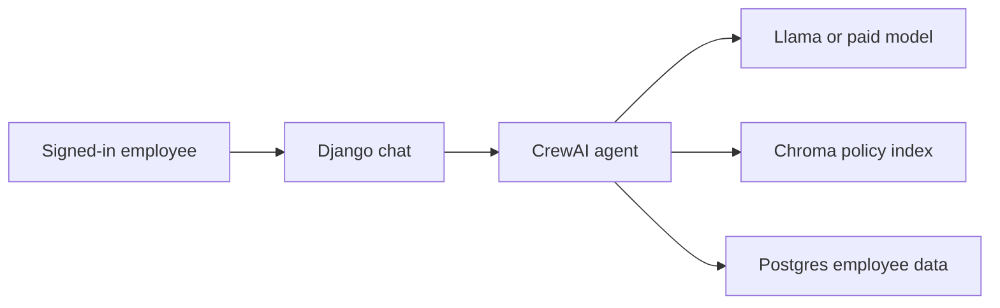

# Architecture

This is a proof of concept. It shows an authenticated HR agent that can answer from published policy and from the signed-in employee's own leave record.

## Flow

1. The employee signs in. Django session authentication identifies the person.
2. The question and a short transcript go to one CrewAI agent.
3. The agent reasons, then calls tools. Tool arguments never choose whose record is read. Each tool closes over the signed-in employee.
4. Policy tools query Chroma. Leave tools query Postgres and the leave-rule functions.
5. The model writes the answer from those tool results. The page shows the tool trace and the policy sections that were retrieved.

## Framework

CrewAI is the agent framework. There is one `Northstar HR Assistant` agent and one task. With a hosted model (Groq or OpenAI), planning is turned on, so the agent writes a short plan before it calls tools. With local Ollama on a CPU, planning is off because that extra model pass takes several minutes; the agent goes straight to tool calling. `memory` is off on purpose: retrieval goes through our Chroma index, not a second hidden store.

The agent is allowed six tool iterations. That is enough for a balance lookup plus a policy search, and it stops a local model from looping.

## Retrieval

`policies/*.md` is the knowledge source. `python manage.py index_policies` splits each file on headings and upserts the sections into a persistent Chroma collection named `hr_policies`. Embeddings are Chroma's local MiniLM model, so indexing does not need a paid API. Search uses cosine distance and returns the document name, section, excerpt, and distance. The chat UI lists those sections as citations.

Postgres is not the vector store. It holds users, employee profiles, leave balances, leave requests, holidays, chat transcripts, and an access log of which tool ran.

## Tools

| Tool | Source |
| --- | --- |
| `search_hr_policies` | Chroma |
| `get_my_leave_balances` | Postgres |
| `get_my_profile` | Postgres |
| `get_my_leave_history` | Postgres |
| `list_company_holidays` | Postgres |
| `calculate_leave_days` | Holiday rows plus the leave rules |
| `check_leave_eligibility` | Balance, probation, notice, and the calculation |

Leave math lives in `apps/directory/leave_rules.py`, not in the prompt. The model is told to call a tool before it states a number. The December 2026 example in the leave policy matches the calculator: earned leave from 22 December 2026 through 2 January 2027 deducts 10 days; the same range as sick leave deducts 7.

## Model choice

| Provider | When | Cost |
| --- | --- | --- |
| Ollama `llama3.2` | Local Llama, including the optional Docker profile | Free |
| Groq `openai/gpt-oss-120b` | `GROQ_API_KEY` is set | Free tier |
| OpenAI `gpt-4o-mini` | `OPENAI_API_KEY` is set | Paid |

`LLM_PROVIDER=auto` checks Groq, then OpenAI, then a local Ollama. Set the variable to one name to force that provider.

Groq is called through CrewAI's native OpenAI client pointed at Groq's OpenAI-compatible endpoint. CrewAI's LiteLLM route forwards an internal prompt-cache field that Groq rejects.

## Access boundaries

- Chat and the API require a signed-in employee.
- A question that asks for another employee's balance, or for a list of everyone's leave, is refused before the model runs.
- Tools do not accept an employee id. They reload the employee captured when the request started.
- Sick-leave answers can explain the certificate rule. The database does not store symptoms or diagnoses, and the agent is instructed not to ask for them.
- Each tool call writes an `AccessAuditLog` row with the employee and the tool name.
- Demo passwords and the local Postgres password live in `.env`, which is not committed. `.env.example` documents the local proof-of-concept values.
- A production deployment would put Postgres on a private network, keep secrets in a secret manager, serve Django over HTTPS, and replace the local Chroma folder with a managed vector database. That deployment is outside this proof of concept.

## Context

Each chat session stores messages in Postgres. The next question receives the last six messages, trimmed, so a follow-up such as "What if I book that as sick leave?" can reuse the dates already in the conversation. New chat starts a new session and drops that context.
